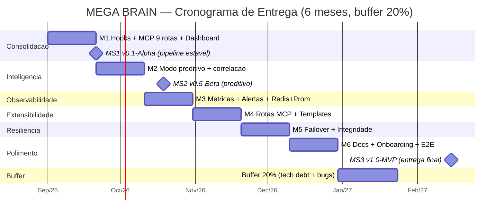

# Cronograma e Marcos — MEGA BRAIN

> Plano físico de entrega (3–6 meses) com mitigação de risco via buffer de engenharia.
> Versão PlantUML equivalente: [`docs/uml/gantt.puml`](uml/gantt.puml).

## 1. Gantt (Mermaid) — 6 meses + buffer 20%

> Marcos: **v0.1-Alpha** (M1, pipeline estável), **v0.5-Beta** (M2, modo preditivo),
> **v1.0-MVP** (M6, documentação + testes E2E). O buffer de 25 dias cobre débito
> técnico e estabilização de bugs críticos descobertos em qualquer fase.

## 2. Dependências entre marcos
- **MS2** só após **MS1** (base heurística pronta).
- **M3** após **MS1** (dashboard gerado como fonte de métricas).
- **M5** após **M3** (métricas de integridade necessárias para failover).
- MVP testável apenas após **Sprint 2** (hooks + reindex + watcher).

## 3. Buffer de Engenharia (20%)
Reservado para:
- Correção de bugs em hooks (try/catch falha-segura).
- Ajustes de Dataview / templates.
- Falhas de agendamento Windows (Agendador de Tarefas).
- Refino de documentação e testes E2E.
- Estabilização do caminho Redis/Prometheus (M3).

## 4. Matriz de Capacidade (perfis necessários)
| Perfil | Dedicação | Responsabilidades principais |
|--------|-----------|------------------------------|
| **Engenheiro Full-Stack / PowerShell + Python** | 1 FT (6 meses) | Hooks, MCP server, reindex, watcher, backup, CI |
| **Arquiteto de IA / Data Engineer** | 0.3 FT (M2–M3, M5) | Modos preditivo/correlação, embeddings (v2.0), cache, métricas |
| **Revisor (Hermes Agent)** | contínuo | Validação de vault, lint/SAST, smoke test no CI |
| **Product Owner (Marcelo)** | 0.2 FT | Priorização de backlog, aceite de marcos |

## 5. Ambiente de execução
- Windows 10/11, Obsidian + Dataview, Python 3.10+, PowerShell 7, Git.
- Validação/CI: contêiner `validate` (pwsh + py3.11) + Redis/Grafana (compose, M3).
- Custo externo: apenas se v2.0 usar API de embeddings/LLM (ver `docs/brainstorm.md`).

---

## 6. STATUS REAL (atualizado em 2026-08-23)

> Medido contra o disco (fonte autoritativa) e os critérios de aceitação dos sprints.

**Data de referência**: 2026-08-23 (sistema). O cronograma formal inicia 2026-09-01,
mas o desenvolvimento correu à frente — S1/S2/S3 já implementados.

### Etapa atual
- **Cronograma**: **M4 (Extensibilidade) CONCLUÍDO**. Resta: M6 (Polimento).
- **Sprint**: **Sprint 7 — M4 Extensibilidade** concluído (veja `docs/sprints/sprint-7.md`).
  `validate_vault.py` + rota `GET /validate` (estrutura/frontmatter/links quebrados).

### Percentual por ESCOPO entregue (mais honesto que o tempo)
| Fase | Status | % |
|------|--------|---:|
| M1 Consolidacao | DONE (hooks, MCP 11 rotas, dashboard, backup) | 100% |
| M2 Inteligencia | DONE (preditivo S3-1, correlacao S3-2, templates S3-4) | 100% |
| Sprint 3 (M4/M2) | DONE (rename/move S3-3, runbook S3-5) | 100% |
| Sprint 4 QA | DONE (debounce watcher + E2E hooks + CI estendido) | 100% |
| M3 Observabilidade | DONE (`/metrics` Prometheus + cache TTL memória/Redis) | 100% |
| M5 Resiliencia | DONE (failover 2o destino + verify_integrity.ps1) | 100% |
| **M4 Extensibilidade** | **DONE** (rotas extras + templates + /validate continuo) | 100% |
| M6 Polimento | docs/quality/chronogram/uml OK; E2E hooks/backup/validate feitos | ~75% |

**Conclusao**: ~90% do conteudo de M1–M5 (e M4) já existe. Resta polimento de M6
(últimos ajustes de qualidade/docs). Por linha do tempo (calendario) ainda nao comecou
(inicio 01/09), mas o trabalho real ja cobriu M1+M2+S3+S4+S5+S6+S7.

### Cobertura de testes (inegociavel do `docs/quality.md`)
- Smoke MCP: **8/8 PASS** (`tests/smoke_test.py` — inclui `/metrics` + cache)
- E2E validação (M4): **2/2 PASS** (`tests/e2e_validate.py`)
- Debounce watcher: **4/4 PASS** (`tests/test_watcher_debounce.py`)
- E2E hooks: **4/4 PASS** (`tests/e2e_hooks.py`)
- E2E resiliência: **3/3 PASS** (`tests/e2e_backup.py`)
- CI: `ci-cd.yml` roda lint (PSScriptAnalyzer+py_compile) + SAST (bandit+gitleaks) +
  test-linux (smoke + e2e_validate + debounce) + test-windows (E2E hooks + E2E backup) + build Docker.

