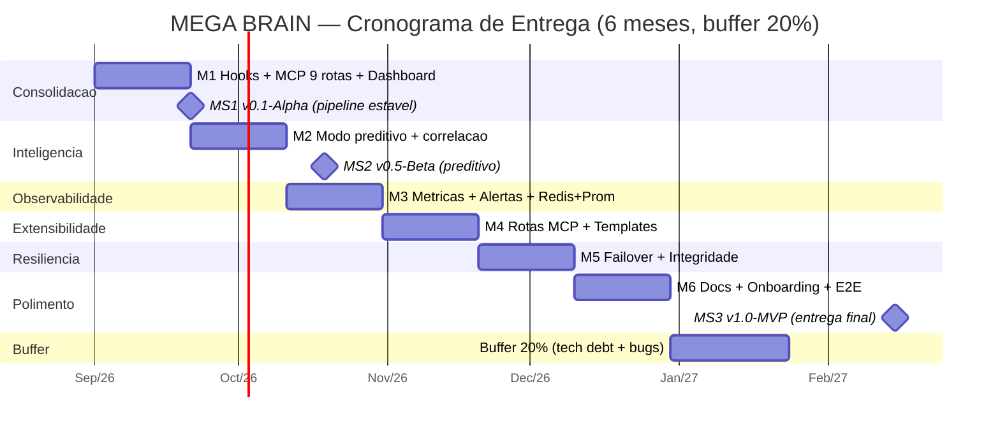

# Cronograma e Marcos — MEGA BRAIN

> Plano físico de entrega (3–6 meses) com mitigação de risco via buffer de engenharia.
> Versão PlantUML equivalente: [`docs/uml/gantt.puml`](uml/gantt.puml).

## 1. Gantt (Mermaid) — 6 meses + buffer 20%

> Marcos: **v0.1-Alpha** (M1, pipeline estável), **v0.5-Beta** (M2, modo preditivo),
> **v1.0-MVP** (M6, documentação + testes E2E). O buffer de 25 dias cobre débito
> técnico e estabilização de bugs críticos descobertos em qualquer fase.

## 2. Dependências entre marcos
- **MS2** só após **MS1** (base heurística pronta).
- **M3** após **MS1** (dashboard gerado como fonte de métricas).
- **M5** após **M3** (métricas de integridade necessárias para failover).
- MVP testável apenas após **Sprint 2** (hooks + reindex + watcher).

## 3. Buffer de Engenharia (20%)
Reservado para:
- Correção de bugs em hooks (try/catch falha-segura).
- Ajustes de Dataview / templates.
- Falhas de agendamento Windows (Agendador de Tarefas).
- Refino de documentação e testes E2E.
- Estabilização do caminho Redis/Prometheus (M3).

## 4. Matriz de Capacidade (perfis necessários)
| Perfil | Dedicação | Responsabilidades principais |
|--------|-----------|------------------------------|
| **Engenheiro Full-Stack / PowerShell + Python** | 1 FT (6 meses) | Hooks, MCP server, reindex, watcher, backup, CI |
| **Arquiteto de IA / Data Engineer** | 0.3 FT (M2–M3, M5) | Modos preditivo/correlação, embeddings (v2.0), cache, métricas |
| **Revisor (Hermes Agent)** | contínuo | Validação de vault, lint/SAST, smoke test no CI |
| **Product Owner (Marcelo)** | 0.2 FT | Priorização de backlog, aceite de marcos |

## 5. Ambiente de execução
- Windows 10/11, Obsidian + Dataview, Python 3.10+, PowerShell 7, Git.
- Validação/CI: contêiner `validate` (pwsh + py3.11) + Redis/Grafana (compose, M3).
- Custo externo: apenas se v2.0 usar API de embeddings/LLM (ver `docs/brainstorm.md`).

---

## 6. STATUS REAL (atualizado em 2026-08-23)

> Medido contra o disco (fonte autoritativa) e os critérios de aceitação dos sprints.

**Data de referência**: 2026-08-23 (sistema). O cronograma formal inicia 2026-09-01,
mas o desenvolvimento correu à frente — S1/S2/S3 já implementados.

### Etapa atual
- **Cronograma**: **M6 (Polimento) CONCLUÍDO → v1.0-MVP ENTREGUE**. **v2.0 (Inovação) CONCLUÍDO**. **Sprint 10 (Ativação & Consolidação) CONCLUÍDO** (S10-A/B/C) → **v2.1.0**.
- **Sprint**: **Sprint 10 — S10-A/B/C** concluído (veja `docs/sprints/sprint-10.md`).
  - S10-A: Ollama sidecar (compose) + `.env` OLLAMA + `e2e_ollama` + push backlinks.
  - S10-B: rota `/graph` + `web/dashboard.html` (grafo de conhecimento).
  - S10-C: `governance.py` (Prompt Injection + PII) em swarm/llm_local + `e2e_governance`.

### Percentual por ESCOPO entregue (mais honesto que o tempo)
| Fase | Status | % |
|------|--------|---:|
| M1 Consolidacao | DONE | 100% |
| M2 Inteligencia | DONE | 100% |
| Sprint 3 (M4/M2) | DONE | 100% |
| Sprint 4 QA | DONE | 100% |
| M3 Observabilidade | DONE | 100% |
| M5 Resiliencia | DONE | 100% |
| M4 Extensibilidade | DONE | 100% |
| M6 Polismo | DONE | 100% |
| v2.0 Inovação | DONE | 100% |
| **S10 Ativação & Consolidação** | **DONE** (S10-A produção / S10-B dashboard / S10-C governança) | 100% |

**Conclusao**: **100% do escopo M1–M6 + v2.0 + S10 entregue**. v1.0.0 (S1–S8), v2.0.0 (S9),
v2.1.0 (S10) atingidos em 2026-08-23. Ativação de IA real: `OLLAMA_URL`+`OLLAMA_MODEL`.

### Cobertura de testes (inegociavel do `docs/quality.md`)
- Suíte completa (`tests/run_all.py`): **10/10 suítes verdes**
- Smoke MCP: **8/8 PASS** · E2E validação M4: **2/2** · E2E v2.0: **5/5** ·
  E2E Ollama S10-A: **SKIP** (offline) · E2E Dashboard S10-B: **PASS** ·
  E2E Governanca S10-C: **PASS** · E2E integração: **3/3** · E2E resiliência: **3/3** · E2E hooks: **4/4** · Debounce: **4/4**
- CI: `ci-cd.yml` roda lint + SAST + test-linux (smoke+e2e_validate+debounce+e2e_v2+
  e2e_ollama+e2e_dashboard+e2e_governance+**run_all**) + test-windows (E2E hooks+backup) + build Docker.

[[gantt]]

[[sprint-8]]

[[README]]

---

## 7. LOG DE MANUTENÇÃO AUTÔNOMA (iterações)

> Registro incremental de melhorias de engenharia aplicadas após o v2.1.0,
> sempre validadas por `python tests/run_all.py` (10/10 suítes verdes) + FCS no browser.

### Sessão 2026-08-24 — Robustez de automação (P8/P9/P11/P12/P13/P14)
- **P11 — Cache de grafo por mtime** (mitiga O(n²) Jaccard do `/graph`):
  - `graph.py`: nova `build_graph_cached(vault, k, limit, ttl)` com cache thread-safe
    invalidado por assinatura do vault (mtime máximo + contagem de notas) ou TTL.
    `k`/`limit` fazem parte da chave → `/graph?k=5` e `?k=3` têm caches distintos.
  - `mcp_obsidian_server.py`: rota `/graph` passa a usar `build_graph_cached`, expondo
    flag `cached` no JSON. Verificado: 50ms (miss) → 2ms (hit, 25×), invalida ao tocar arquivo.
- **P8 — `do_GET` envelope total**: todo o `do_GET` envolto em `try/except` que retorna
  `500 {"error": "unhandled GET error: ..."}` (nunca derruba a conexão). Rotas v2.0 já tinham try/except.
- **P9 — confirmado**: `_norm_rel` (semantic), `compress_note` (compress) e `_vault_path`
  (server) já normalizam separadores corretamente; nenhuma alteração necessária.
- **P12/P14 — remoção de split órfão**: `web/dashboard.js` e `web/dashboard.css` eram
  duplicados não referenciados (anti-padrão do P12). Removidos; `web/dashboard.html`
  é o arquivo único inline canônico. Checado `wc -c` após cada write.
- **P13 — FCS no browser**: dashboard servido em fixture (3–4 notas, 1 órfão) e validado
  via `browser_console`: grafo (5 nós/7 arestas), donut (5 fatias), heatmap (1 célula),
  órfãos (1), BFS A→B, foco, busca+highlight, `/validate` e teste de conexão — sem erros de runtime.
- **Docs**: `80_SYSTEM/README.md` expandido com tabela de scripts + mapa de pitfalls P1–P14;
  `docs/chronogram.md` com este log de manutenção.
- **Status**: 10/10 suítes verdes mantidas; `node --check` não aplicável (JS inline).

Próximas melhorias seguras identificadas (não concluídas — baixo risco/baixo ganho):
- `swarm._agent_metric`/`_agent_indexer` re-walk o vault; poderiam reaproveitar cache de `/stats`.
- `semantic._vault_notes` (limit=400) vs `graph` (limit=600) — unificar teto de notas.

